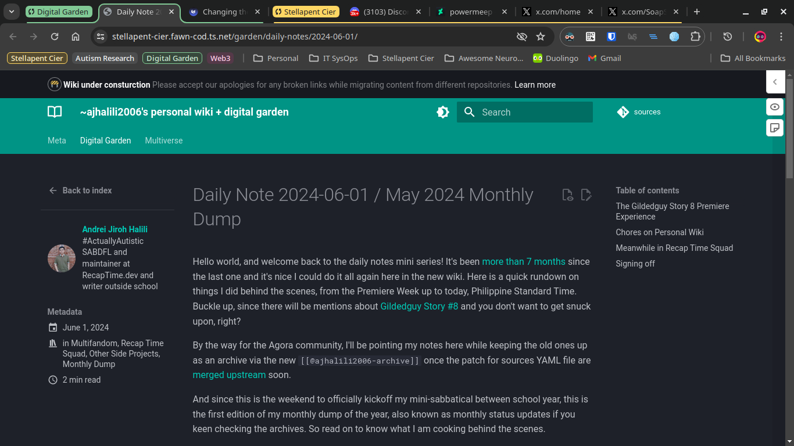

> **Hello there, editor Andrei speaking on the line.** This should be technically published exactly in the Philippine Indepedence Day,
> but since I am currently between a mini sabatical and EOSY rest for the next school year, I apologize if
> it took longer than expected. So I decided to publish it now from the backburner and finalize it later.

Hello world, and welcome back to the monthly dump/status update! Pardon the radio silence
over the few months, I am just busy at school during those period, but since I am
in the end-of-school-year break, we're actually back for at least two issues of this,
alongside the daily journaling on [my personal wiki]
Buckle up, since there will be mentions about [Gildedguy Story #8][gildedguy-story8] and you
don't want to [get snuck-up on][md-spoilers-ep7], right?

By the way for the Agora community, I'll be pointing my notes here while keeping the old ones
up as an archive via the new `[[@ajhalili2006-archive]]` once the patch for sources YAML file
are [merged upstream](https://github.com/flancian/agora/pull/32) soon.

And since this is the weekend (as of 2024-06-01) to officially kickoff my mini-sabbatical between
school year, this is the first edition of my monthly dump of the year,
also known as monthly status updates if you keen checking the archives.
So read on to know what I am cooking behind the scenes.

## The [[Gildedguy Story 8]] Premiere Experience

  <iframe width="1280" height="720" src="https://www.youtube.com/embed/1156Dq6TaHg" frameborder="0" allowfullscreen></iframe>

I literally woke up early on May 12 to catch up the Twitch premiere ([original VOD link],
[archived in 1080p] via Storj DCS) just few minutes before it start. Based on the first watch, not only
it was another banger[^1] by [Michael Moy][mikedmoy] and the production team based on what
the community saying, but there are new lore have been dropped since [[Gildedguy Story 7]].
I'll be not able to take note them all here in detail, but please take a watch for yourself.

It's a blast after all, so [grab your "I Was There In Premiere" badge][luma] for free
if you're there (either via Twitch or YouTube). And expect a in-depth post on it and
more on [my blog] later this month (or just before the next school year starts).
If you need some Gildedguy Stories-themed mixtape on
your library, [I made one since March] and currently open for song suggestions.

## Chores on Personal Wiki

Since this Material for Mkdocs-powered site [started in last year][initial-commit],
I am currently working to merge both the old digital garden and Jiroh's Kooky
Insane Stuff into here, alongside an upcoming one for Traumatized Autistics Department.
Due to how the content migration is currently underway, you may see this
non-dismissable banner on the top of every page similarly to this one below
([link to commit]):

!!! info ""
    :construction: **Wiki under consturction** Please accept our apologies for any broken links while migrating content from different repositories. [Learn more](../../../migration-progress.md)

### But wait, what's [[Traumatized Autistics Department]]?

[Here]'s the Google Doc for the project README (currently a public draft), but in a nutshell, this is where

## Meanwhile in Recap Time Squad

In summary for everyone asking, just self-documentation, janitorial and admin work on Recap Time Squad lately.

Nothing too heavy other than bringing the Staff SSO terms and mini reorganization chores in our [policy site],
content updates on [the Squad Wiki], and even setting up a [brand assets repository] to host our different
brand assets as we export them from Canva, similarily to the [`cdnjs/brand` GitHub repo](https://github.com/cdnjs/brand)
and others.

## Signing off

That's all for now and thanks for reading. Talk to you soon on the next edition, or
[read the archives for this year so far][archive]. For occassional chaos on your feed
and for comments, [follow me/tag on socials] or [send a e-fanmail](https://tally.so/r/nrB4o2).

[^1]: For Smosh fans, this may be obvious. ([context](https://www.urbandictionary.com/define.php?term=Another%20banger))

[gildedguy-story8]: https://go.andreijiroh.xyz/story8
[archive]: https://wiki.andreijiroh.xyz/garden/daily-notes/archive/2024/
[original VOD link]: https://www.twitch.tv/videos/2143318582
[archived in 1080p]: https://vod.cdn.andreijiroh.xyz/twitch/gildedguy/2143318582/vod.mp4
[luma]: https://lu.ma/gildedguy-story8
[blog]: https://ajhalili2006.substack.com
[policy site]: https://github.com/recaptime-dev/legal-policies/commits?author=ajhalili2006&since=2024-04-30&until=2024-05-30
[follow me/tag on socials]: https://ajhalili2006.start.page
[I made one since March]: https://open.spotify.com/playlist/0qW0g1QAeChWLSKXuasuM3
[the Squad Wiki]: <https://github.com/recaptime-dev/squad-wiki/commits?author=ajhalili2006&since=2024-04-30&until=2024-05-30>
[brand assets repository]: <https://github.com/recaptime-dev/brand-assets>
[mikedmoy]: <https://wiki.andreijiroh.xyz/go/mikedmoy>
[initial-commit]: <https://mau.dev/andreijiroh-dev/wiki/-/commit/649b4b7520ace6235f5fb45299d659a9bb3cbdd1>
[md-spoilers-ep7]: <https://murder-drones.fandom.com/wiki/Cyn#:~:text=%22Oh%20yes%2C-,get%20snuck%2Dup%20on,-.%22>
[Here]: <https://docs.google.com/document/d/1HQc19r6K2ZYSFWaJObqxg_36Mbk6SMD1jiGJPuIEifc/edit?usp=sharing>
[link to commit]: https://mau.dev/andreijiroh-dev/wiki/-/blob/f0949fe1055f30a79fe3870f0be5207218484bda/overrides/main.html#L17-22
[my personal wiki]: https://wiki.andreijiroh.xyz/garden/daily-notes
